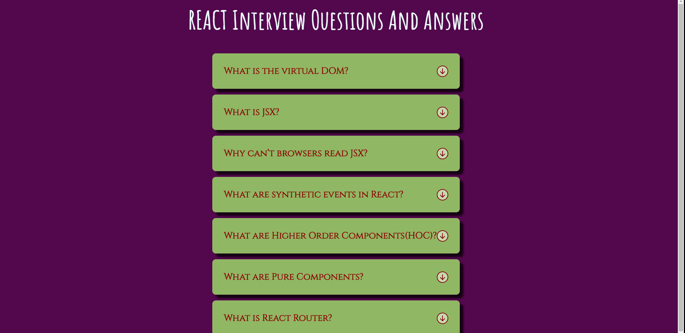

## Description

*I created this project using react hook(useState), conditional rendering, icons.*

[LİVE]()

## How does my project look 

## Tech/framework used
* React
* React Hook(useState)
* Conditional Rendering

In the project directory, you can run:

### `npm start` && `npm install`

